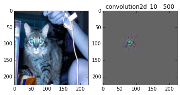
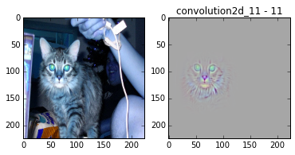
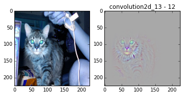
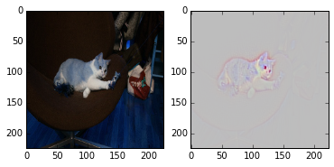
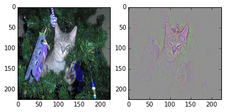

# Visulazing Convolution Networks

## Requirements

- Up to date versions of Keras and Theano
- OpenCV3
- matplotlib, numpy, jupyter-notebook (recommend using [Anaconda](https://www.continuum.io/downloads))

## Configuration
- Download the [VGG16 keras weights](https://gist.github.com/baraldilorenzo/07d7802847aaad0a35d3) and put them in ./

## How to use
- Run [`Visualizing.ipynb`](./Visualizing.ipynb) cell by cell in jupyter-notebook

### Get the deconvolution result of your own image, for a specific layer and feature map

    target_layer = "convolution2d_11"
    feat_map = 12
    output = deconv(model, target_layer, feat_map, im)`
Change `target_layer` and `feat_map` to what you want.

## Results
**With receiptive field increases, activated area changes**

  

  

  

  

**Different filter map responses for different area of input image**

  

**Back pass from the last fully connected layer (represntation of classfication result)**

  

  

## Reference

- [Visualizing and Understanding Convolutional Networks](https://arxiv.org/pdf/1311.2901v1.pdf)
